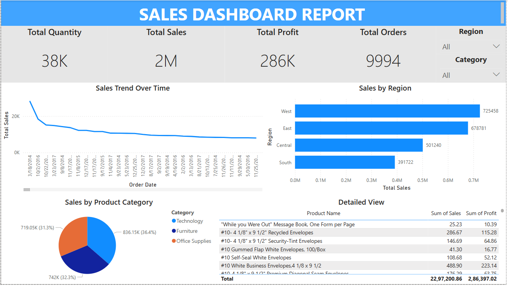

# 📊 Power BI Sales Dashboard Project

## 🔍 Project Overview
This is a beginner-level Power BI project focused on building a Sales Dashboard using a sample Superstore dataset. It covers KPIs, interactive visuals, slicers, and DAX basics.

## 🧱 Tools Used
- Power BI Desktop
- DAX
- CSV Data Source (Superstore)

## 🧩 Key Features
- Total Sales, Quantity, Profit, Orders
- Sales trend over time (Line Chart)
- Sales by Region (Bar Chart)
- Sales by Category (Pie Chart)
- Interactive slicers for Region & Category
- Detailed table with product-level insights

## 📷 Dashboard Screenshot

## 📁 Files Included
- `Sales_Dashboard.pbix`: Power BI file
- `sales_data.csv`: Source dataset (optional)
- `README.md`: Project documentation
- `/screenshots/`: Dashboard image

## ✅ Skills Practiced
- Data modeling & transformation
- Creating calculated columns & measures
- Dashboard layout and visual best practices
- Interactive filters and slicers

---

## 📌 Next Steps
- Add date range slicers
- Publish to Power BI Service
- Try forecasting or trend-based visuals

---

### 🔗 Connect With Me
- LinkedIn:www.linkedin.com/in/nikhil-sai-karanki
